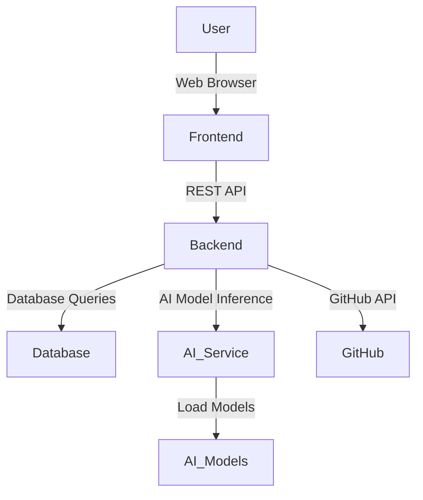

# Architecture

The system follows a modular, multi-tiered architecture, designed for scalability, maintainability, and clear separation of concerns.

## High-Level Diagram

## Component Breakdown

### 1. Frontend (React Application)

*   **Purpose**: Provides the user interface for interaction with the system. It consumes data from the Backend API and visualizes analytical results.
*   **Technologies**: React, Vite, JavaScript/JSX, CSS.
*   **Key Modules/Folders**:
    *   `src/pages`: Contains main application views.
    *   `src/components`: Reusable UI components.
    *   `src/services`: Handles API calls to the backend.
    *   `src/contexts`: Manages global state.

### 2. Backend (FastAPI Application)

*   **Purpose**: Acts as the central hub, exposing RESTful APIs, managing data, and orchestrating AI model interactions.
*   **Technologies**: Python, FastAPI, Uvicorn, SQLAlchemy, Alembic.
*   **Key Modules/Folders**:
    *   `main.py`: Entry point of the FastAPI application.
    *   `api/routes`: Defines API endpoints (e.g., `commit_routes.py`, `branch.py`).
    *   `services`: Contains business logic and interacts with external services (e.g., `github_service.py`, `commit_service.py`, `multifusion_v2_service.py`).
    *   `db`: Database connection, models, and session management (`database.py`, `models/`).
    *   `schemas`: Pydantic models for request/response validation.
    *   `core`: Configuration, security, and logging (`config.py`, `security.py`).
    *   `ai`: Integration with AI models and services (`han_ai_service.py`, `multifusion_ai_service.py`).

### 3. AI Service/Models

*   **Purpose**: Houses the trained machine learning models and provides inference capabilities to the Backend.
*   **Technologies**: Python, PyTorch/TensorFlow, Hugging Face Transformers (likely).
*   **Key Modules/Folders**:
    *   `backend/ai/models`: Stores trained model weights and configurations.
    *   `backend/ai/multimodal_fusion_network`: Contains the implementation of the Multifusion model, data processing, and training logic.
    *   `backend/ai/han_commit_analyzer.py`: Logic for the Hierarchical Attention Network model.
    *   `backend/services/han_ai_service.py`, `backend/services/multifusion_ai_service.py`: Services to load and use these models.

### 4. Database (PostgreSQL)

*   **Purpose**: Persists all application data, including repository information, commit details, analysis results, and user data.
*   **Technologies**: PostgreSQL.
*   **ORM**: SQLAlchemy with Alembic for migrations.
*   **Key Modules/Folders**:
    *   `backend/db/database.py`: Database session and engine setup.
    *   `backend/db/models`: SQLAlchemy ORM models defining table schemas.
    *   `backend/migrations`: Alembic scripts for database schema evolution.

### 5. GitHub API

*   **Purpose**: External service used by the Backend to fetch real-time and historical data from GitHub repositories.
*   **Integration**: Handled primarily by `backend/services/github_service.py`.
