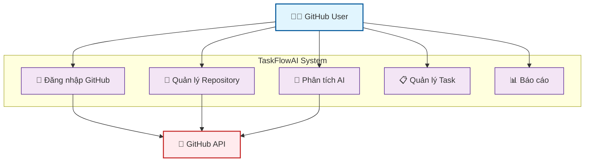

# 🎯 USE CASE DIAGRAM - TASKFLOWAI (Đơn giản)

## 1. USE CASE TỔNG QUÁT



---

## 2. USE CASE CHI TIẾT

```mermaid
graph TB
    %% Actor
    USER[👨‍💻 GitHub User]

    %% System với chi tiết
    subgraph System["TaskFlowAI - Chi tiết"]
        
        %% Authentication
        UC01[🔐 GitHub OAuth Login]
        UC02[👤 Xem Profile]
        
        %% Repository
        UC03[📂 Xem danh sách Repo]
        UC04[🔗 Kết nối Repo]
        UC05[📋 Chi tiết Repo]
        
        %% AI Analysis  
        UC06[🤖 Phân tích Commit]
        UC07[📈 Phân loại Commit]
        UC08[📊 Thống kê Commit]
        
        %% Task Management
        UC09[📋 Kanban Board]
        UC10[✅ Tạo/Sửa Task]
        UC11[👥 Phân công Task]
        
        %% AI Insights
        UC12[💡 Gợi ý AI]
        UC13[⚠️ Cảnh báo Workload]
        
        %% Reports
        UC14[📊 Báo cáo AI]
        UC15[📈 Dashboard]
    end

    %% External Systems
    GitHub[🐙 GitHub API]
    Database[🗄️ Database]

    %% User connections
    USER --> UC01
    USER --> UC02
    USER --> UC03
    USER --> UC04
    USER --> UC05
    USER --> UC06
    USER --> UC09
    USER --> UC10
    USER --> UC12
    USER --> UC14
    USER --> UC15

    %% External connections
    UC01 --> GitHub
    UC04 --> GitHub
    UC06 --> GitHub
    
    UC09 --> Database
    UC10 --> Database
    UC14 --> Database

    %% Include relationships (đơn giản)
    UC06 -.->|includes| UC07
    UC06 -.->|includes| UC08
    UC09 -.->|includes| UC11
    UC12 -.->|includes| UC13
    UC15 -.->|includes| UC14

    classDef actor fill:#e1f5fe,stroke:#01579b,stroke-width:2px
    classDef auth fill:#fff3e0,stroke:#e65100,stroke-width:1px
    classDef repo fill:#f3e5f5,stroke:#4a148c,stroke-width:1px
    classDef ai fill:#e8f5e8,stroke:#1b5e20,stroke-width:1px
    classDef task fill:#e3f2fd,stroke:#0277bd,stroke-width:1px
    classDef insight fill:#fce4ec,stroke:#c2185b,stroke-width:1px
    classDef report fill:#f1f8e9,stroke:#388e3c,stroke-width:1px
    classDef external fill:#ffebee,stroke:#c62828,stroke-width:2px

    class USER actor
    class UC01,UC02 auth
    class UC03,UC04,UC05 repo
    class UC06,UC07,UC08 ai
    class UC09,UC10,UC11 task
    class UC12,UC13 insight
    class UC14,UC15 report
    class GitHub,Database external
```



---

## 📋 MÔ TẢ NGẮN GỌN

### **TỔNG QUÁT (5 chức năng chính):**

1. **🔐 Đăng nhập GitHub** - OAuth authentication
2. **📂 Quản lý Repository** - Connect và sync repos  
3. **🤖 Phân tích AI** - HAN + CodeBERT analysis
4. **📋 Quản lý Task** - Kanban board, assignments
5. **📊 Báo cáo** - Metrics và insights

### **CHI TIẾT (15 use cases):**

#### **Authentication:**
- UC01: GitHub OAuth Login
- UC02: Xem Profile User

#### **Repository:**  
- UC03: Xem danh sách Repository
- UC04: Kết nối Repository
- UC05: Chi tiết Repository

#### **AI Analysis:**
- UC06: Phân tích Commit với AI
- UC07: Phân loại Commit Message  
- UC08: Thống kê Commit

#### **Task Management:**
- UC09: Kanban Board
- UC10: Tạo/Sửa Task
- UC11: Phân công Task

#### **AI Insights:**
- UC12: Gợi ý AI cho assignment
- UC13: Cảnh báo Workload

#### **Reports:**
- UC14: Báo cáo AI Analysis
- UC15: Dashboard tổng quan

---

## 🎭 ACTOR

**GitHub User** - Người dùng đăng nhập qua GitHub OAuth với full access

---

## 🔄 FLOW CHÍNH

```
Login → Connect Repo → AI Analysis → Task Management → View Reports
```

---

## 🏗️ KIẾN TRÚC

- **Frontend**: React + Ant Design
- **Backend**: FastAPI  
- **Database**: PostgreSQL
- **AI**: HAN + CodeBERT
- **Auth**: GitHub OAuth
