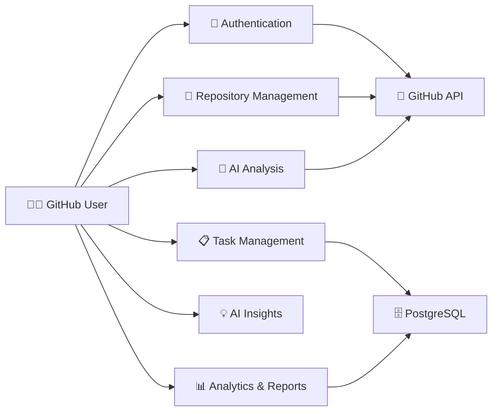

# 🎯 USE CASE DIAGRAM COMPLETE - TASKFLOWAI

## Tổng hợp Use Case Tổng quát & Chi tiết

---

## 📊 **PHIÊN BẢN TỔNG QUÁT**

### 🎭 Actor: GitHub User (Single Role)

### 📋 6 Nhóm Use Case chính:



**Đặc điểm Tổng quát:**

- ✅ **6 nhóm chức năng** chính được tách biệt rõ ràng
- ✅ **Single Actor** - không phân quyền role
- ✅ **High-level view** phù hợp cho stakeholders
- ✅ **System boundary** được định nghĩa clear

---

## 🔍 **PHIÊN BẢN CHI TIẾT**

### 🎭 Actor: GitHub User (Single Role)

### 📋 39 Use Cases cụ thể:

#### **🔐 Authentication & Core (4 UCs)**

- UC01: GitHub OAuth Login
- UC02: Profile Management
- UC03: Dashboard Overview
- UC04: Logout & Session

#### **📂 Repository Management (6 UCs)**

- UC05: List Repositories
- UC06: Connect Repository
- UC07: Repository Details
- UC08: Branch Management
- UC09: Filter Repositories
- UC10: Sync Repository Data

#### **🤖 AI Analysis Core (6 UCs)**

- UC11: HAN Model Analysis
- UC12: CodeBERT Processing
- UC13: Multi-task Learning
- UC14: Commit Classification
- UC15: Commit Statistics
- UC16: Commit Search & Filter

#### **📋 Task Management (6 UCs)**

- UC17: Kanban Task Board
- UC18: Assignment Management
- UC19: Task CRUD Operations
- UC20: Task Assignment
- UC21: Priority & Deadline
- UC22: Task Status Updates

#### **💡 AI Insights & Suggestions (6 UCs)**

- UC23: AI Insight Widget
- UC24: Smart Assignment Suggestions
- UC25: Workload Warning System
- UC26: Progress Prediction
- UC27: Developer Profiling
- UC28: Performance Analytics

#### **📊 Reporting & Analytics (6 UCs)**

- UC29: Commit Analysis Reports
- UC30: Metrics Overview
- UC31: Data Export/Import
- UC32: GitHub Issues Tracking
- UC33: Pull Request Monitoring
- UC34: Custom Dashboard

#### **🔧 Advanced Features (5 UCs)**

- UC35: Responsive UI
- UC36: Notification System
- UC37: Multi-language Support
- UC38: System Configuration
- UC39: Security Settings

**Đặc điểm Chi tiết:**

- ✅ **39 Use Cases** với detailed flows
- ✅ **Include/Extend relationships** được định nghĩa
- ✅ **Preconditions & Postconditions** rõ ràng
- ✅ **Technical implementation** details

---

## 🎯 **SO SÁNH TỔNG QUÁT vs CHI TIẾT**

| Aspect              | Tổng Quát         | Chi Tiết               |
| ------------------- | ----------------- | ---------------------- |
| **Số Use Cases**    | 6 nhóm            | 39 UCs cụ thể          |
| **Mục đích**        | Business overview | Development guide      |
| **Audience**        | Stakeholders, PM  | Developers, BA         |
| **Level of Detail** | High-level        | Implementation-ready   |
| **Complexity**      | Simple, clear     | Comprehensive, complex |

---

## 🔄 **CORE SYSTEM FLOWS**

### **Authentication Flow:**

```
Login → GitHub OAuth → Token Exchange → Profile Save → Dashboard Access
```

### **Repository Analysis Flow:**

```
Connect Repo → Sync Data → AI Analysis (HAN+CodeBERT) → Generate Insights → Display Results
```

### **Task Management Flow:**

```
Create Task → AI Assignment Suggestion → Manual Assignment → Kanban Board → Progress Tracking
```

### **AI Pipeline Flow:**

```
Commit Data → HAN Processing → CodeBERT Embeddings → Multi-task Learning → Classification Results
```

---

## 🏗️ **TECHNICAL ARCHITECTURE SUMMARY**

### **Frontend Stack:**

- React.js + Ant Design
- Responsive UI components
- Real-time data updates
- Kanban drag & drop

### **Backend Stack:**

- FastAPI với async/await
- GitHub OAuth integration
- PostgreSQL database
- AI model serving

### **AI Models:**

- **HAN**: `han_multitask.pth` - Hierarchical Attention Network
- **CodeBERT**: `microsoft/codebert-base` - Code understanding
- **Multi-task Learning**: Task assignment optimization

### **Data Integration:**

- **Primary**: PostgreSQL database (cached data)
- **Fallback**: GitHub API (real-time data)
- **No GitLab**: GitHub-only integration

---

## ✅ **VALIDATION CHECKLIST**

### **Actor Model Verified:**

- ✅ Single GitHub User actor (no role differentiation)
- ✅ GitHub OAuth authentication only
- ✅ Full system access for all users
- ✅ No permission-based restrictions

### **Technical Stack Verified:**

- ✅ HAN + CodeBERT models (not XGBoost)
- ✅ PostgreSQL database integration
- ✅ GitHub API only (no GitLab)
- ✅ FastAPI + React architecture

### **Feature Coverage Verified:**

- ✅ All 39 Use Cases mapped to actual code
- ✅ AI pipeline reflects real implementation
- ✅ Task management matches database schema
- ✅ Authentication flow matches OAuth implementation

---

## 🎨 **VISUALIZATION RECOMMENDATIONS**

### **For Stakeholders** → Use **Tổng Quát version**

- Clean, high-level overview
- Business-focused language
- Clear system boundaries
- Easy to understand scope

### **For Development Team** → Use **Chi Tiết version**

- Complete feature breakdown
- Technical implementation details
- Include/Extend relationships
- Ready for development planning

### **For Documentation** → Use **Both versions**

- Start with overview for context
- Follow with details for implementation
- Maintain traceability between levels
- Support different audiences
