# 🎯 USE CASE DETAILED - TASKFLOWAI

## Biểu đồ Use Case Chi tiết với Flow mở rộng

```mermaid
graph TB
    %% Actor
    USER[👨‍💻 GitHub User]

    %% Detailed System boundary
    subgraph System["🎯 TaskFlowAI - Chi tiết đầy đủ"]

        %% Authentication & Core (Level 1)
        subgraph AUTH["🔐 Authentication & Core"]
            UC01[🔐 GitHub OAuth Login]
            UC02[👤 Profile Management]
            UC03[📊 Dashboard Overview]
            UC04[🚪 Logout & Session]
        end

        %% Repository Management (Level 1)
        subgraph REPO["📂 Repository Management"]
            UC05[📂 List Repositories]
            UC06[🔗 Connect Repository]
            UC07[📋 Repository Details]
            UC08[🌿 Branch Management]
            UC09[🏷️ Filter Repositories]
            UC10[🔄 Sync Repository Data]
        end

        %% AI Core Engine (Level 1)
        subgraph AI_CORE["🤖 AI Analysis Core"]
            UC11[🧠 HAN Model Analysis]
            UC12[🔤 CodeBERT Processing]
            UC13[🎯 Multi-task Learning]
            UC14[📈 Commit Classification]
            UC15[📊 Commit Statistics]
            UC16[🔍 Commit Search & Filter]
        end

        %% Task Management (Level 1)
        subgraph TASK_MGMT["📋 Task Management"]
            UC17[📋 Kanban Task Board]
            UC18[✅ Assignment Management]
            UC19[🎯 Task CRUD Operations]
            UC20[👥 Task Assignment]
            UC21[⏰ Priority & Deadline]
            UC22[🔄 Task Status Updates]
        end

        %% AI Insights & Suggestions (Level 1)
        subgraph AI_INSIGHTS["💡 AI Insights & Suggestions"]
            UC23[💡 AI Insight Widget]
            UC24[🤖 Smart Assignment Suggestions]
            UC25[⚠️ Workload Warning System]
            UC26[📈 Progress Prediction]
            UC27[👤 Developer Profiling]
            UC28[🎯 Performance Analytics]
        end

        %% Reporting & Analytics (Level 1)
        subgraph REPORTS["📊 Reporting & Analytics"]
            UC29[📊 Commit Analysis Reports]
            UC30[📈 Metrics Overview]
            UC31[🔄 Data Export/Import]
            UC32[📋 GitHub Issues Tracking]
            UC33[🔍 Pull Request Monitoring]
            UC34[📋 Custom Dashboard]
        end

        %% Advanced Features (Level 1)
        subgraph ADVANCED["🔧 Advanced Features"]
            UC35[📱 Responsive UI]
            UC36[🔔 Notification System]
            UC37[🌐 Multi-language Support]
            UC38[⚙️ System Configuration]
            UC39[🔒 Security Settings]
        end
    end

    %% External Systems
    GitHub[🐙 GitHub API]
    Database[🗄️ PostgreSQL Database]
    AIModels[🧠 AI Model Files]

    %% User connections to all main categories
    USER --> AUTH
    USER --> REPO
    USER --> AI_CORE
    USER --> TASK_MGMT
    USER --> AI_INSIGHTS
    USER --> REPORTS
    USER --> ADVANCED

    %% Detailed user connections
    USER --> UC01
    USER --> UC02
    USER --> UC03
    USER --> UC05
    USER --> UC06
    USER --> UC07
    USER --> UC17
    USER --> UC19
    USER --> UC23
    USER --> UC24
    USER --> UC29
    USER --> UC30

    %% External system connections
    UC01 --> GitHub
    UC06 --> GitHub
    UC10 --> GitHub
    UC11 --> GitHub
    UC32 --> GitHub
    UC33 --> GitHub

    UC02 --> Database
    UC03 --> Database
    UC17 --> Database
    UC18 --> Database
    UC19 --> Database
    UC29 --> Database
    UC30 --> Database

    UC11 --> AIModels
    UC12 --> AIModels
    UC13 --> AIModels

    %% Include relationships (Core dependencies)
    UC03 -.->|includes| UC30
    UC03 -.->|includes| UC23
    UC07 -.->|includes| UC08
    UC11 -.->|includes| UC12
    UC11 -.->|includes| UC13
    UC14 -.->|includes| UC11
    UC15 -.->|includes| UC14
    UC17 -.->|includes| UC18
    UC17 -.->|includes| UC22
    UC20 -.->|includes| UC24
    UC23 -.->|includes| UC25
    UC24 -.->|includes| UC27
    UC29 -.->|includes| UC11
    UC29 -.->|includes| UC14

    %% Extend relationships (Optional enhancements)
    UC24 -.->|extends| UC20
    UC25 -.->|extends| UC18
    UC26 -.->|extends| UC29
    UC09 -.->|extends| UC05
    UC16 -.->|extends| UC15
    UC21 -.->|extends| UC19
    UC28 -.->|extends| UC27
    UC34 -.->|extends| UC03
    UC36 -.->|extends| UC25
    UC38 -.->|extends| UC02

    %% Styling
    classDef actor fill:#e1f5fe,stroke:#01579b,stroke-width:3px
    classDef auth fill:#fff3e0,stroke:#e65100,stroke-width:2px
    classDef repo fill:#f3e5f5,stroke:#4a148c,stroke-width:2px
    classDef aicore fill:#e8f5e8,stroke:#1b5e20,stroke-width:2px
    classDef task fill:#e3f2fd,stroke:#0277bd,stroke-width:2px
    classDef insights fill:#fce4ec,stroke:#c2185b,stroke-width:2px
    classDef reports fill:#f1f8e9,stroke:#388e3c,stroke-width:2px
    classDef advanced fill:#fafafa,stroke:#616161,stroke-width:2px
    classDef external fill:#ffebee,stroke:#c62828,stroke-width:2px
    classDef usecase fill:#ffffff,stroke:#666666,stroke-width:1px

    class USER actor
    class AUTH,UC01,UC02,UC03,UC04 auth
    class REPO,UC05,UC06,UC07,UC08,UC09,UC10 repo
    class AI_CORE,UC11,UC12,UC13,UC14,UC15,UC16 aicore
    class TASK_MGMT,UC17,UC18,UC19,UC20,UC21,UC22 task
    class AI_INSIGHTS,UC23,UC24,UC25,UC26,UC27,UC28 insights
    class REPORTS,UC29,UC30,UC31,UC32,UC33,UC34 reports
    class ADVANCED,UC35,UC36,UC37,UC38,UC39 advanced
    class GitHub,Database,AIModels external
```



---

## 📋 CHI TIẾT CÁC USE CASE

### 🔐 **AUTHENTICATION & CORE**

#### **UC01: GitHub OAuth Login**

- **Actor**: GitHub User
- **Precondition**: User có GitHub account
- **Main Flow**:
  1. User click "Login with GitHub"
  2. Redirect tới GitHub OAuth
  3. User authorize với scopes: read:user, user:email, repo
  4. GitHub callback với access token
  5. Save user info vào database
  6. Redirect tới Dashboard
- **Postcondition**: User được authenticate và có access token

#### **UC02: Profile Management**

- **Actor**: GitHub User
- **Precondition**: User đã login
- **Main Flow**:
  1. User access profile section
  2. View GitHub profile info (username, email, avatar)
  3. Update display preferences
  4. Save changes to database
- **Postcondition**: Profile updated successfully

#### **UC03: Dashboard Overview**

- **Actor**: GitHub User
- **Precondition**: User đã login
- **Main Flow**:
  1. Load dashboard components
  2. Display metrics overview cards
  3. Show AI insight widgets
  4. Present repository summary
  5. Real-time data updates
- **Include**: UC30 (Metrics Overview), UC23 (AI Insights)

---

### 📂 **REPOSITORY MANAGEMENT**

#### **UC05: List Repositories**

- **Actor**: GitHub User
- **Precondition**: User đã login
- **Main Flow**:
  1. Query repositories từ database
  2. Fallback to GitHub API nếu cần
  3. Display repository list với metadata
  4. Enable sorting và pagination
- **Extend**: UC09 (Filter Repositories)

#### **UC06: Connect Repository**

- **Actor**: GitHub User
- **Precondition**: User có access đến repository
- **Main Flow**:
  1. User select repository từ GitHub
  2. Sync repository metadata
  3. Download commits, branches, issues
  4. Save to database
  5. Enable repository trong system
- **Postcondition**: Repository available for analysis

#### **UC07: Repository Details**

- **Actor**: GitHub User
- **Precondition**: Repository đã connected
- **Main Flow**:
  1. Display repository overview
  2. Show commits, branches, issues
  3. Present AI analysis results
  4. Enable task management
- **Include**: UC08 (Branch Management)

---

### 🤖 **AI ANALYSIS CORE**

#### **UC11: HAN Model Analysis**

- **Actor**: GitHub User (via UC14)
- **Precondition**: HAN model loaded, commit data available
- **Main Flow**:
  1. Load han_multitask.pth model
  2. Process commit messages through HAN
  3. Generate hierarchical attention weights
  4. Classify commit categories
  5. Return analysis results
- **Include**: UC12 (CodeBERT), UC13 (Multi-task Learning)

#### **UC12: CodeBERT Processing**

- **Actor**: GitHub User (via UC14)
- **Precondition**: CodeBERT model available
- **Main Flow**:
  1. Load microsoft/codebert-base model
  2. Generate code embeddings
  3. Analyze semantic similarity
  4. Extract code features
  5. Return embedding vectors

#### **UC14: Commit Classification**

- **Actor**: GitHub User
- **Precondition**: Repository connected, AI models loaded
- **Main Flow**:
  1. Fetch commits từ repository
  2. Process through HAN model
  3. Classify commits (feat, fix, docs, style, etc.)
  4. Calculate confidence scores
  5. Store results in database
- **Include**: UC11 (HAN Analysis)

---

### 📋 **TASK MANAGEMENT**

#### **UC17: Kanban Task Board**

- **Actor**: GitHub User
- **Precondition**: Repository selected
- **Main Flow**:
  1. Load existing tasks từ database
  2. Display Kanban với columns: TODO, IN_PROGRESS, DONE
  3. Enable drag & drop functionality
  4. Support task filtering và searching
  5. Real-time updates
- **Include**: UC18 (Assignment Management), UC22 (Status Updates)

#### **UC19: Task CRUD Operations**

- **Actor**: GitHub User
- **Precondition**: Repository access
- **Main Flow**:
  1. Create: Show task form với fields (title, description, assignee, priority, due_date)
  2. Read: Display task details và history
  3. Update: Edit task properties
  4. Delete: Remove task với confirmation
  5. Save changes to database
- **Extend**: UC21 (Priority & Deadline)

#### **UC20: Task Assignment**

- **Actor**: GitHub User
- **Precondition**: Tasks exist, collaborators available
- **Main Flow**:
  1. Select task to assign
  2. Choose assignee từ collaborators list
  3. Optionally get AI suggestion
  4. Update assignment in database
  5. Notify assignee (if implemented)
- **Extend**: UC24 (Smart Assignment Suggestions)

---

### 💡 **AI INSIGHTS & SUGGESTIONS**

#### **UC23: AI Insight Widget**

- **Actor**: GitHub User
- **Precondition**: AI analysis completed
- **Main Flow**:
  1. Display dashboard widget
  2. Show key AI insights
  3. Present recommendations
  4. Highlight important patterns
  5. Enable drill-down analysis
- **Include**: UC25 (Workload Warnings)

#### **UC24: Smart Assignment Suggestions**

- **Actor**: GitHub User
- **Precondition**: Developer profiles available, task to assign
- **Main Flow**:
  1. Analyze task requirements
  2. Profile developers based on commit history
  3. Calculate match scores
  4. Suggest best assignee với reasoning
  5. Allow user acceptance/modification
- **Include**: UC27 (Developer Profiling)

#### **UC25: Workload Warning System**

- **Actor**: GitHub User
- **Precondition**: Task assignments, commit analysis
- **Main Flow**:
  1. Monitor developer workloads
  2. Detect overload conditions
  3. Generate warnings
  4. Suggest workload rebalancing
  5. Display alerts on dashboard
- **Extend**: UC36 (Notification System)

---

### 📊 **REPORTING & ANALYTICS**

#### **UC29: Commit Analysis Reports**

- **Actor**: GitHub User
- **Precondition**: AI analysis completed
- **Main Flow**:
  1. Generate comprehensive analysis report
  2. Include classification statistics
  3. Show developer insights
  4. Present trends và patterns
  5. Enable export functionality
- **Include**: UC11 (HAN Analysis), UC14 (Classification)

#### **UC30: Metrics Overview**

- **Actor**: GitHub User
- **Precondition**: Data available
- **Main Flow**:
  1. Calculate key metrics (commits, tasks, velocity)
  2. Display overview cards
  3. Show progress indicators
  4. Present comparative analytics
  5. Real-time updates

---

## 🔄 SYSTEM INTEGRATION FLOW

### **Primary Data Flow:**

```
GitHub OAuth → Repository Sync → AI Analysis → Task Management → Insights Generation → Reports
```

### **AI Pipeline:**

```
Commits → HAN Model → CodeBERT → Multi-task Learning → Classification → Insights
```

### **Task Flow:**

```
Create Task → AI Assignment Suggestion → Manual Assignment → Kanban Board → Progress Tracking
```

---

## 🎯 SYSTEM CHARACTERISTICS

### **Authentication Model**: Single-tier GitHub OAuth

### **Data Architecture**: Database-first với GitHub API fallback

### **AI Integration**: HAN + CodeBERT + Multi-task Learning

### **UI Pattern**: Responsive SPA với real-time updates

### **Access Control**: No role restrictions, full access for all users
