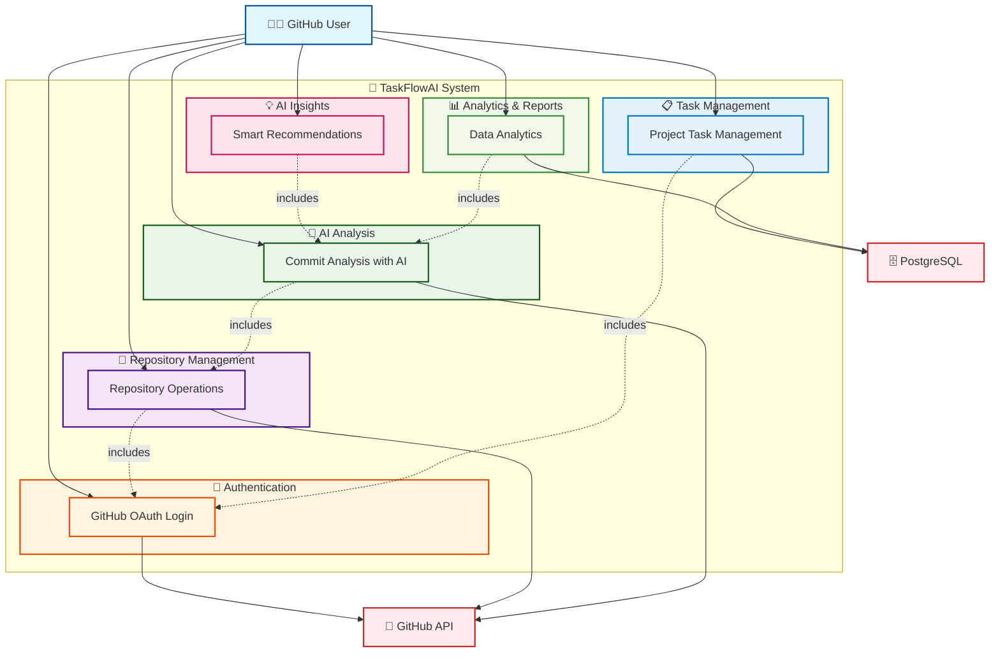

# 🎯 USE CASE OVERVIEW - TASKFLOWAI

## Biểu đồ Use Case Tổng quan



---

## 📋 TỔNG QUAN CÁC NHÓM USE CASE

### 🔐 **Authentication**

- GitHub OAuth login/logout
- User profile management
- Token management

### 📂 **Repository Management**

- View repositories list
- Connect/sync repositories from GitHub
- Repository details & branch management
- Repository filtering

### 🤖 **AI Analysis**

- HAN Model commit analysis
- CodeBERT embeddings
- Multi-task learning
- Commit classification & statistics

### 📋 **Task Management**

- Kanban task board
- Task CRUD operations
- Assignment management
- Priority & deadline tracking

### 💡 **AI Insights**

- Smart assignment suggestions
- Workload warnings
- Progress predictions
- Developer profiling

### 📊 **Analytics & Reports**

- Commit analysis reports
- Metrics dashboard
- Data export/import
- GitHub issues/PRs tracking

---

## 🎭 ACTOR CHARACTERISTICS

### **GitHub User** 👨‍💻

- **Access Level**: Full system access
- **Authentication**: GitHub OAuth required
- **Permissions**: No role restrictions
- **Capabilities**: All features available

---

## 🔄 SYSTEM FLOW

```
1. GitHub OAuth → 2. Repository Sync → 3. AI Analysis → 4. Task Management → 5. Insights & Reports
```

### **Core Workflow:**

1. **Login** via GitHub OAuth
2. **Connect** repositories từ GitHub
3. **Analyze** commits với AI models
4. **Manage** tasks trên Kanban board
5. **View** insights và generate reports

---

## 🏗️ TECHNICAL ARCHITECTURE

### **Frontend**: React.js + Ant Design

### **Backend**: FastAPI + Async

### **Database**: PostgreSQL + SQLAlchemy

### **AI Models**: HAN + CodeBERT + Multi-task Learning

### **Integration**: GitHub API Only

### **Authentication**: GitHub OAuth (Single-tier)
